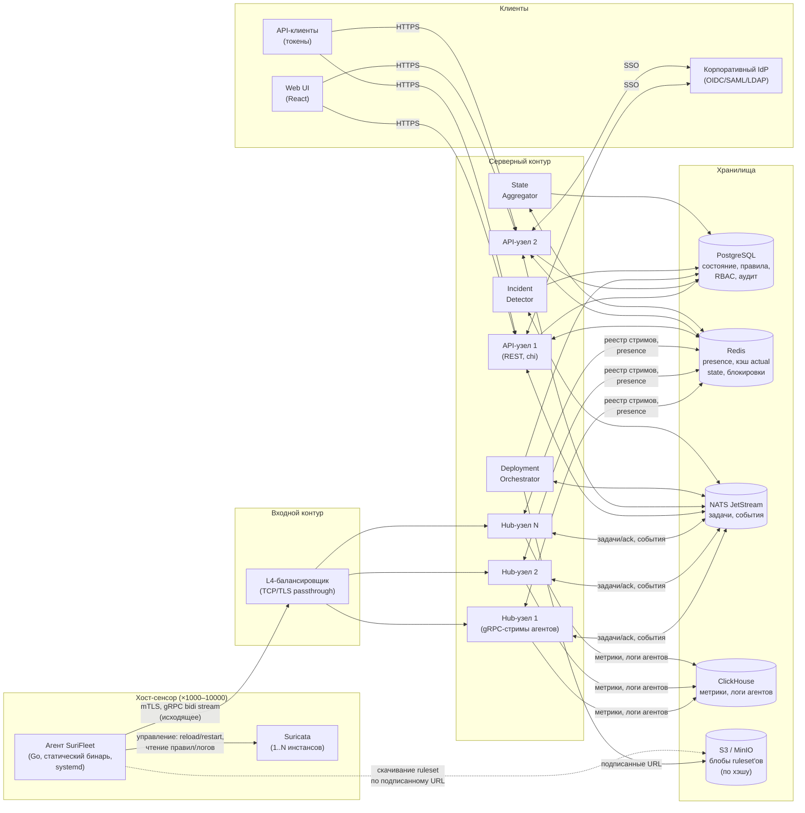
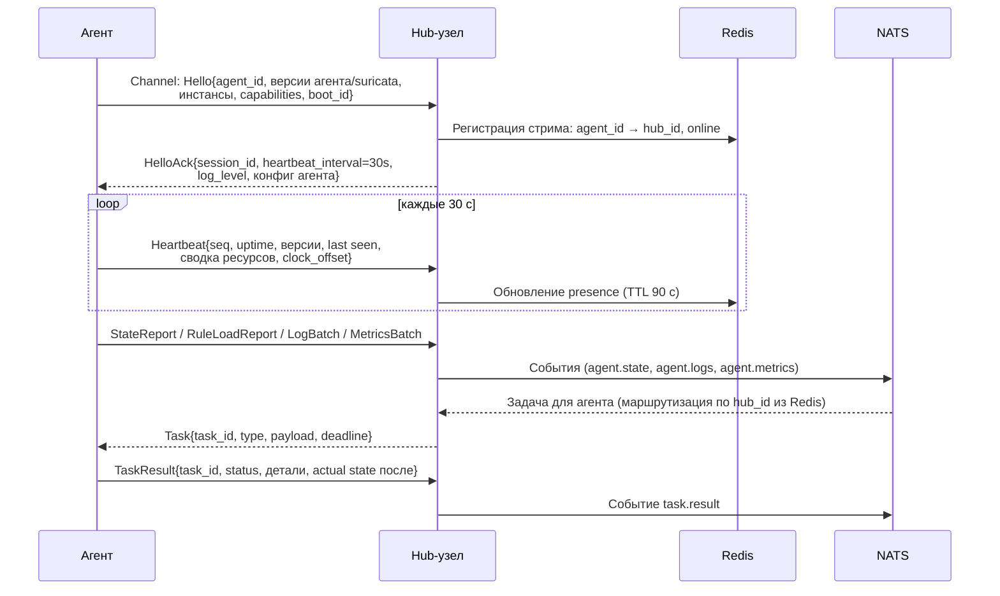
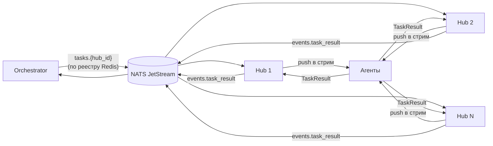
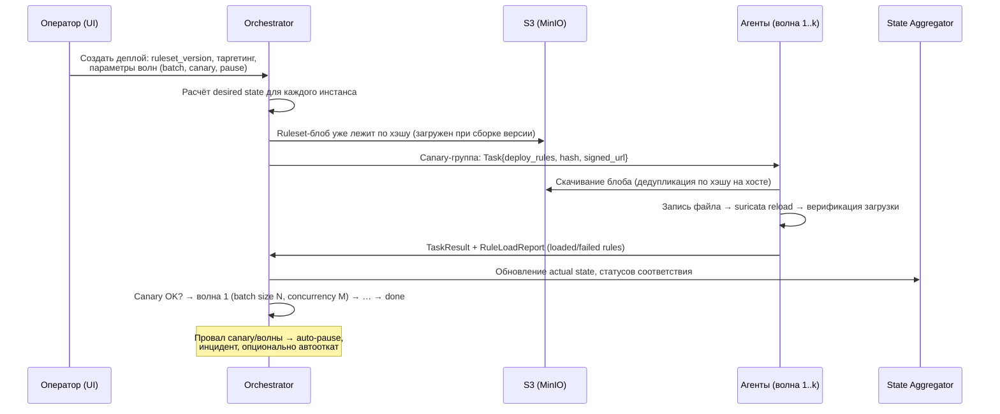

# Архитектура SuriFleet

Версия: 0.1 (чанк 1). Статус: базовый каркас, уточняется по ходу реализации.

Документ отвечает на три вопроса из п. 11 ТЗ:

1. Из каких компонентов состоит система и как они связаны.
2. Как устроен протокол агент↔сервер (gRPC bidi stream поверх mTLS).
3. Как система масштабируется на 1 000–10 000 одновременно подключённых агентов.

---

## 1. Обзор

SuriFleet — клиент-серверная система:

- **Агент** на каждом хосте с Suricata сам устанавливает **исходящее**
  gRPC-соединение (bidirectional stream) к серверу — работает за NAT и
  файрволом без входящих портов. По этому стриму идут heartbeat, отчёты о
  фактическом состоянии, операционные логи агента и задачи от сервера.
- **Сервер** — две роли процессов из одного бинаря:
  - **API-узлы** (stateless) — REST API для UI и автоматизации, RBAC, SSO;
  - **Hub-узлы** (концентраторы) — держат долгоживущие стримы агентов.
- **Хранилища по назначению**: PostgreSQL — состояние и метаданные; Redis —
  горячее состояние (presence, кэш actual state, блокировки); NATS JetStream —
  задачи и события; ClickHouse — метрики и логи агентов; S3 (MinIO) —
  content-addressed блобы ruleset'ов.

Ключевой принцип: **деплой считается успешным только по подтверждению агента
о фактической загрузке правил движком Suricata**, а не по коду возврата
команды доставки файла.

## 2. Компонентная диаграмма



**Разделение ролей узлов.** Один бинарь `surifleet-server` запускается с флагом
роли (`--role=api|hub|all`). Для оценки (docker-compose) — один процесс
`--role=all`; в продакшене API и Hub масштабируются независимо: API по RPS,
Hub по числу стримов.

**Почему Hub отделён от API.** Стримы — долгоживущие stateful-соединения с
аффинити (агент подключён к конкретному узлу), а API — stateless. Разные
профили нагрузки и разные политики обновления: рестарт API-узлов не должен
ронять 10k стримов.

## 3. Модель флота

```
Организация (tenant)
  └── Кластер (логическая группа: площадка, сегмент сети)
        └── Хост (машина с агентом)
              └── Инстанс Suricata (1..N на хосте: свой suricata.yaml,
                  свой набор интерфейсов захвата, отдельный systemd-юнит)
```

- Все сущности деплоя, метрик и UI оперируют **инстансом** как атомом
  «куда ставятся правила». Хост — атом «где живёт агент».
- Онбординг без переустановки: агент детектит существующие инстансы
  (сервисы, бинарь, suricata.yaml, каталоги правил/логов, интерфейсы, версию,
  флаги сборки) и передаёт на сервер для подтверждения пользователем.
- Передача контроля поэтапная: 6 независимых capability на кластер/хост —
  `monitoring`, `rules`, `log_rotation`, `service_mgmt`, `packages`, `config`.
  Дефолт — только `monitoring`. Любое изменение — после бэкапа.

## 4. Протокол агент↔сервер

Полный контракт — в `api/proto/agent/v1/agent.proto` (чанк 3), здесь — схема
и принципы.

### 4.1 Канал

- Один RPC: `rpc Channel(stream AgentMessage) returns (stream ServerMessage)` —
  двунаправленный стрим поверх HTTP/2, TLS обязателен (**mTLS**:
  индивидуальный клиентский сертификат агента, CN = agent_id).
- Агент — инициатор соединения, всегда исходящее (443/TCP), работает за NAT.
- Первичная регистрация (enrollment) — отдельный одноразовый токен
  (join token) по обычному TLS, результат — ключи и сертификат агента
  (см. §10).

### 4.2 Конверт сообщений

Оба направления — типизированный `oneof` внутри конверта с общими полями:

```
Envelope {
  msg_id        // UUID, для ack и идемпотентности
  seq           // монотонный номер в рамках сессии (replay-защита)
  sent_at       // timestamp отправителя (детект рассинхронизации часов)
  payload       // oneof: Hello | Heartbeat | StateReport | RuleLoadReport |
                //      LogBatch | MetricsBatch | TaskResult | ... (агент)
                //      HelloAck | Task | ConfigPush | LogLevelChange |
                //      TaskCancel | ... (сервер)
}
```

### 4.3 Жизненный цикл соединения



### 4.4 Типы сообщений (агент → сервер)

| Сообщение | Периодичность | Назначение |
|---|---|---|
| `Hello` | при подключении | Идентификация: agent_id, версии, инстансы, boot_id, capabilities |
| `Heartbeat` | 30 с | last seen, uptime, сводка CPU/RAM/диск, clock_offset, статус сервиса Suricata |
| `StateReport` | после деплоя + каждые 5 мин | Actual state: хэш ruleset на диске, загруженные правила, failed rules с текстом парсера, результат последнего reload/restart |
| `MetricsBatch` | 60 с | Метрики Suricata (kernel drops, flow, detect) и хоста, батчем → ClickHouse |
| `LogBatch` | по накоплению/таймеру | Операционные логи агента (JSON), at-least-once с seq для дедупликации |
| `TaskResult` | по задаче | Результат задачи + снапшот actual state после изменения |
| `DiscoveryReport` | при онбординге | Найденные инстансы Suricata, пути, версии, интерфейсы |

### 4.5 Типы сообщений (сервер → агент)

| Сообщение | Назначение |
|---|---|
| `HelloAck` | session_id, интервалы, текущий log_level, конфиг агента |
| `Task` | Задача: `deploy_rules` (ruleset_hash + подписанный URL), `deploy_config`, `service_action` (reload/restart/stop), `rollback`, `collect_bundle`, `agent_update`, `set_capabilities` |
| `TaskCancel` | Отмена задачи по task_id |
| `LogLevelChange` | Смена уровня логирования агента на лету (debug/info/warn/error) |
| `ConfigPush` | Настройки самого агента (интервалы, параметры ротации логов) |

### 4.6 Идемпотентность и надёжность

- Каждая задача имеет `task_id` (UUID); агент хранит журнал обработанных
  task_id на диске — повторная доставка не выполняется дважды.
- `TaskResult` доставляется at-least-once: сервер дедуплицирует по task_id.
- Деплой ruleset идемпотентен по `ruleset_hash`: если хэш на диске совпадает,
  агент только делает reload и отчитывается.
- Защита от replay: `seq` монотонен в рамках сессии (session_id в HelloAck);
  сервер отбрасывает сообщения с seq ≤ последнего виденного.

### 4.7 Переподключение (клиентская сторона)

- Exponential backoff: 1 с → 2 с → 4 с … max 60 с, **полный jitter**
  (random в [0, backoff]) — защита от reconnect-шторма после рестарта Hub.
- При потере канала агент продолжает работу на последней конфигурации,
  буферизует логи и метрики на диск (ротация, см. §9) и досылает после
  восстановления.

## 5. Масштабирование на 10 000 агентов

### 5.1 Концентраторы стримов (Hub)

- 10k одновременных gRPC-стримов — штатный режим для одного Go-процесса
  (по ~1–2 горутины на стрим, ~8–16 МБ RSS на 10k стримов плюс буферы).
  Закладываем **2–4 Hub-узла** на 10k агентов — для отказоустойчивости и
  rolling-обновлений, а не из-за предела производительности.
- L4-балансировщик распределяет подключения. **Аффинити не требуется**:
  агент может попасть на любой Hub при каждом переподключении.

### 5.2 Реестр стримов в Redis

- Ключ `stream:{agent_id}` → `{hub_id, session_id, connected_at}`, TTL 120 с,
  продлевается heartbeat'ами.
- Ключ `hub:{hub_id}:agents` — set агентов узла (для выборки при старте/стопе).
- Задача агенту: Orchestrator читает `stream:{agent_id}` → публикует в NATS
  subject `tasks.{hub_id}` → только нужный Hub получает и пушит в стрим.
- Агент offline: Hub зафиксировал разрыв стрима (`agent.disconnected`) ЛИБО
  свипер heartbeat-таймаута погасил агента: heartbeat продлевает Redis-TTL
  и троттлингом (не чаще 30 с) пишет `last_seen_at` в PG; фоновый свипер
  (роль hub|all, `server.offline_sweep_interval`, default 30 с) переводит
  online-агентов с `last_seen_at` старше `server.agent_offline_after`
  (default 120 с) в offline + `agent_state_history` (reason
  heartbeat-timeout). Если heartbeat возобновляется у уже погашенного
  агента (разморозка процесса, заживший TCP), пульс возвращает его в
  online (reason heartbeat-resumed).

### 5.3 Fan-out задач через NATS JetStream



- Для волнового деплоя используется очередь с явными ack и `max_deliver` —
  задача не теряется при падении Hub.
- События (`agent.heartbeat.missed`, `agent.state_report`, `task.result`,
  `incident.*`) — отдельные subjects; детекторы инцидентов и агрегатор
  состояния — независимые консьюмеры (потоковая обработка, не полный обход).

### 5.4 Reconnect-штормы

- Jitter + backoff на агенте (§4.7).
- Hub при старте ограничивает темп принятия стримов (token bucket) и
  растягивает обработку Hello.
- Heartbeat'ы обрабатываются без записи в PostgreSQL на каждое сообщение —
  Redis (TTL) + троттлированный (не чаще 30 с) пульс `last_seen_at` для
  свипера offline. В историю (`agent_state_history`) пишутся только смены
  состояния (online→offline и т.п.).

### 5.5 Телеметрия

- Агенты шлют метрики батчами раз в 60 с → Hub пишет в ClickHouse напрямую
  (асинхронный batch-insert). PostgreSQL телеметрию не принимает — в нём
  только агрегированное текущее состояние (last seen, текущий статус,
  версия ruleset).
- Логи агентов — тоже в ClickHouse (отдельная таблица с TTL).

### 5.6 PostgreSQL под нагрузкой

- Партиционирование по времени: `audit_log`, `deploy_events`,
  `agent_state_history` — месячные партиции (pg_partman или нативные).
- Матрица «правила × хосты»: индексы `(instance_id, ...)` на таблицах
  desired/actual state; сводка флота — из материализованной витрины,
  обновляемой инкрементально по событиям (цель < 2 с на 10k инстансов).
- Пагинация в API — только keyset-based (`WHERE id > $1 ORDER BY id LIMIT n`).

## 6. Деплой правил (волновой)



- **Content-addressed хранение**: блоб ruleset адресуется SHA-256; один
  ruleset скачивается на хост один раз (кэш по хэшу), дедупликация между
  кластерами бесплатно.
- **Верификация**: после reload агент сверяет, что движок загрузил правила
  (парсинг вывода/сокета Suricata), собирает failed rules с текстом ошибки.
- **Волны**: batch size, concurrency limit, пауза/продолжение, canary первой.
- **Откат**: предыдущая рабочая версия ruleset хранится на хосте; при падении
  сервиса после деплоя — автоматический откат агентом (см. §7 ТЗ).

## 7. Desired / Actual state и статусы соответствия

- **Desired state**: для каждого инстанса сервер рассчитывает набор
  `(sid, revision, status)` из шаблонов деплоя и таргетинга. Идентификатор
  версии: `ruleset_version + sha256`.
- **Actual state**: отчёт агента (StateReport) — после каждого деплоя и
  периодически (5 мин). Кэш в Redis (`actual:{instance_id}`, TTL),
  история в PostgreSQL с таймстемпом «данные актуальны на …».
- **Статусы** (на инстанс): `in_sync` / `pending` / `partial` (какие правила
  не загрузились и почему) / `drift` (diff desired vs actual) / `stale`
  (агент молчит дольше порога — по умолчанию 10 мин).
- Расчёт статусов — **инкрементальный, по событиям** (StateReport, смена
  desired, таймаут presence), не полным пересчётом. Результат — в Redis
  и денормализованной таблице `instance_compliance` для быстрой сводки.

## 8. Телеметрия и логи агента

- Агент пишет структурные JSON-логи (slog) локально в
  `/var/log/surifleet-agent/agent.log` с ротацией (lumberjack: max size,
  max backups, max age — настраиваются с сервера).
- Каждая запись имеет `seq`; недоставленные записи переживают ротацию
  (журнал «последний подтверждённый seq») и досылаются (at-least-once,
  дедупликация на сервере по `(agent_id, seq)`).
- Уровень логирования меняется с сервера на лету (кластер/хост/агент) через
  `LogLevelChange`, без рестарта.
- На сервере логи — в ClickHouse, доступны в UI с фильтрами
  (хост, уровень, период, операция); error-записи обогащают инциденты.

## 9. Деградация

| Отказ | Поведение |
|---|---|
| Redis недоступен | Hub работает на in-memory реестре (деградация маршрутизации задач до локальных стримов), presence в PG по таймеру; API кэширует ответы |
| NATS недоступен | Задачи ставятся в PG-очередь (outbox), Hub опрашивает её как fallback; события буферизуются |
| S3 недоступен | Новые деплои блокируются с понятным сообщением; агенты на текущих ruleset продолжают работу |
| ClickHouse недоступен | Метрики/логи буферизуются на Hub (ограниченный буфер) с отбрасыванием старейшего |
| PostgreSQL недоступен | API read-only из кэша где возможно; Hub продолжает обслуживать стримы; деплои остановлены |
| Сервер недоступен (у агента) | Агент работает на последней конфигурации, буферизует логи/метрики на диск с ротацией, reconnect с backoff+jitter |

## 10. Безопасность

- **mTLS**: встроенный CA сервера (в MVP — самоподписанный CA, генерируется
  при установке; интерфейс для внешнего PKI позже). Индивидуальный
  сертификат агента, CN = agent_id, срок 90 дней, автоматическая ротация
  через стрим за 30 дней до истечения.
- **Enrollment**: join token (одноразовый, TTL, привязан к кластеру) →
  агент генерирует ключи, отправляет CSR → получает сертификат.
- **Секреты в БД**: шифрование envelope (AES-GCM, ключ из KMS/файла
  конфигурации сервера).
- **Replay-защита**: seq в рамках сессии + mTLS-идентичность.
- **Rate limiting**: Redis token bucket на API и на Hub (сообщений/с на агента).
- **Аудит**: append-only таблица с цепочкой хэшей (каждая запись включает
  хэш предыдущей) — опция `audit.hash_chain=true`.

## 11. Наблюдаемость самой системы

- Prometheus-эндпоинт `/metrics` на API и Hub: число стримов, RPS,
  latency heartbeat, глубина очередей NATS, темп событий.
- Структурные логи (slog) JSON во всех компонентах.
- Трейсинг OpenTelemetry: REST → Orchestrator → NATS → Hub → агент
  (trace_id пробрасывается в task_id метаданные).

## 12. Что сознательно отложено

- Kafka вместо NATS — интерфейс шины абстрагирован, замена возможна.
- Внешний PKI/Vault для CA — после MVP.
- Multi-region федерация — вне рамок ТЗ.
