# Модель данных SuriFleet

Версия: 0.1 (чанк 2). Реализация: `db/migrations/000001_init.up.sql` (PostgreSQL 15+).

Модель флота: **Организация → Кластер → Хост → Инстанс Suricata (1..N)**; на хосте
ровно один **агент**. Атом деплоя и статусов соответствия — **инстанс**, атом
связности и mTLS-идентичности — **агент**.

Общие соглашения:

- PK — `uuid DEFAULT gen_random_uuid()` (pgcrypto), кроме таблиц состояния
  инстанса, где PK — `instance_id` (естественный ключ 1:1).
- Все метки времени — `timestamptz`, `DEFAULT now()` где уместно.
- Enum-подобные поля — `text` + `CHECK (IN (...))`, без `CREATE TYPE`
  (проще эволюция значений без миграций типов).
- FK: `CASCADE` для дочерних сущностей (кластеры в организации, ревизии в
  правиле, задачи в деплое), `RESTRICT` для справочников, на которые ссылается
  история (ruleset_version в desired_state/deployments), `SET NULL` для
  необязательных контекстных ссылок.
- Тенант-изоляция: все доменные сущности несут `organization_id`; уникальность
  бизнес-ключей — в рамках организации.

## 1. ER-диаграмма

```mermaid
erDiagram
    organizations ||--o{ clusters : "содержит"
    organizations ||--o{ users : "включает"
    organizations ||--o{ sso_providers : "настраивает"
    organizations ||--o{ feeds : "подключает"
    organizations ||--o{ rules : "владеет"
    organizations ||--o{ iocs : "владеет"
    organizations ||--o{ deploy_templates : "владеет"
    organizations ||--o{ ruleset_versions : "собирает"
    organizations ||--o{ deployments : "запускает"
    organizations ||--o{ incidents : "фиксирует"
    organizations ||--o{ api_tokens : "выпускает"
    organizations |o--o{ roles : "кастомные роли"

    clusters ||--o{ hosts : "группирует"
    hosts ||--o| agents : "один агент"
    hosts ||--o{ instances : "1..N инстансов"
    clusters ||--o{ capabilities : "контроль кластера"
    hosts ||--o{ capabilities : "контроль хоста"

    sso_providers ||--o{ users : "JIT-провижининг"
    users ||--o{ sessions : "открывает"
    users ||--o{ api_tokens : "выпускает"
    users ||--o{ user_roles : "назначение"
    roles ||--o{ user_roles : "назначена"

    feeds ||--o{ rules : "импортирует"
    feeds ||--o{ iocs : "поставляет"
    rules ||--o{ rule_revisions : "версии"

    instances ||--|| desired_state : "целевое"
    instances ||--|| actual_state : "фактическое"
    instances ||--|| instance_compliance : "сводка"
    ruleset_versions ||--o{ desired_state : "назначена"
    ruleset_versions ||--o{ deployments : "развёртывается"
    deploy_templates ||--o{ deployments : "по шаблону"
    deployments ||--o{ deployment_tasks : "задачи"
    instances ||--o{ deployment_tasks : "цель"
    deployments ||--o{ deploy_events : "события"

    agents ||--o{ agent_state_history : "история статусов"
    hosts ||--o{ incidents : "контекст"
    instances ||--o{ incidents : "контекст"

    organizations {
        uuid id PK
        text name
        text slug UK
    }
    clusters {
        uuid id PK
        uuid organization_id FK
        text name
    }
    hosts {
        uuid id PK
        uuid cluster_id FK
        text hostname
        inet_array ip_addresses
        jsonb labels
    }
    agents {
        uuid id PK
        uuid host_id FK "UNIQUE — один на хост"
        text agent_version
        text protocol_version
        text status "online|degraded|offline|updating|error"
        timestamptz last_seen_at
        text cert_serial "серийник mTLS-сертификата"
    }
    instances {
        uuid id PK
        uuid host_id FK
        text name
        text config_path "путь к suricata.yaml"
        text rules_dir
        text log_dir
        text_array capture_interfaces
        text suricata_version
        text systemd_unit
    }
    capabilities {
        uuid id PK
        uuid cluster_id FK "ровно один из"
        uuid host_id FK "cluster_id/host_id"
        text capability "monitoring|rules|log_rotation|service_mgmt|packages|config"
        boolean enabled
    }
    users {
        uuid id PK
        uuid organization_id FK
        text external_id "subject в IdP"
        uuid provider_id FK
        text email
        text display_name
        text password_hash "только локальные"
        boolean is_break_glass
    }
    roles {
        uuid id PK
        uuid organization_id FK "NULL — встроенная"
        text name
        text_array permissions "rules.read, deploy.write, ..."
        boolean is_builtin
    }
    user_roles {
        uuid id PK
        uuid user_id FK
        uuid role_id FK
        text scope_type "organization|clusters"
        uuid_array cluster_ids
    }
    sso_providers {
        uuid id PK
        uuid organization_id FK
        text type "oidc|saml|ldap"
        jsonb config "без секретов"
        text secret_ref
        jsonb group_role_mapping "группы IdP → роли"
    }
    sessions {
        uuid id PK
        uuid user_id FK
        text refresh_token_hash UK
        timestamptz expires_at
        timestamptz revoked_at
    }
    api_tokens {
        uuid id PK
        uuid organization_id FK
        uuid user_id FK "NULL — сервисный"
        text token_hash UK
        text_array scopes
        timestamptz expires_at
    }
    feeds {
        uuid id PK
        uuid organization_id FK
        text type "et_open|et_pro|taxii|stix|misp|generic"
        text url
        text schedule "cron"
        text credentials_ref "ссылка на секрет"
    }
    rules {
        uuid id PK
        uuid organization_id FK
        bigint sid "UK в рамках организации"
        text msg
        text category
        text_array tags
        text status "enabled|disabled|expired|under_review|deleted"
        integer priority "тюнинг аналитика"
        jsonb threshold "тюнинг аналитика"
        text source_type "file|feed"
        uuid feed_id FK
    }
    rule_revisions {
        uuid id PK
        uuid rule_id FK
        bigint sid
        integer revision "UK (rule_id, revision)"
        text raw "сырой текст правила"
        text hash "sha256"
        jsonb parsed
    }
    iocs {
        uuid id PK
        uuid organization_id FK
        text type "ip|domain|url|md5|sha1|sha256|email"
        text value
        integer score
        uuid feed_id FK
        text status "active|under_review|expired|revoked"
        timestamptz expires_at
    }
    deploy_templates {
        uuid id PK
        uuid organization_id FK
        text name
        jsonb targeting "mode + списки id"
    }
    ruleset_versions {
        uuid id PK
        uuid organization_id FK
        text version
        text sha256 "блоб в S3"
        text s3_key
        jsonb manifest "состав версии"
        integer rule_count
    }
    desired_state {
        uuid instance_id PK "FK, 1:1"
        uuid ruleset_version_id FK
        jsonb computed_rules "[{sid,rev,status}]"
        bigint calc_version "монотонная версия расчёта"
        timestamptz updated_at
    }
    actual_state {
        uuid instance_id PK "FK, 1:1"
        text ruleset_hash "хэш на диске"
        jsonb loaded_rules "[{sid,rev}]"
        jsonb failed_rules "[{sid,rev,error}]"
        jsonb last_reload_result
        timestamptz reported_at "данные актуальны на"
    }
    instance_compliance {
        uuid instance_id PK "FK, 1:1"
        text status "in_sync|pending|partial|drift|stale"
        jsonb details "diff, failed"
        timestamptz updated_at
    }
    deployments {
        uuid id PK
        uuid organization_id FK
        uuid ruleset_version_id FK
        uuid deploy_template_id FK
        jsonb targeting
        integer batch_size
        integer concurrency
        integer canary_size
        text status "pending|running|paused|completed|failed|cancelled"
        uuid initiated_by FK
    }
    deployment_tasks {
        uuid id PK "task_id"
        uuid deployment_id FK
        uuid instance_id FK
        integer wave
        text status "pending|sent|running|succeeded|failed|cancelled|skipped"
        integer attempts
        jsonb result
    }
    incidents {
        uuid id PK
        uuid organization_id FK
        uuid host_id FK
        uuid instance_id FK
        text type
        text severity "info|warning|critical"
        text status "open|ack|resolved"
        text fingerprint "дедупликация"
        jsonb context
        text recommendation
    }
    audit_log {
        uuid id PK "PK (id, created_at)"
        timestamptz created_at PK "партиционирование"
        text actor_type "user|api_token|system|agent"
        uuid actor_user_id
        text action
        text object_type
        jsonb params
        text result "success|denied|error"
        jsonb diff "было → стало"
        text prev_hash "цепочка хэшей"
    }
    deploy_events {
        uuid id PK "PK (id, created_at)"
        timestamptz created_at PK
        uuid deployment_id FK
        text event_type
        jsonb details
    }
    agent_state_history {
        uuid id PK "PK (id, created_at)"
        timestamptz created_at PK
        uuid agent_id FK
        text previous_status
        text status
    }
```

## 2. Описание таблиц

### Флот

| Таблица | Назначение | Ключевые колонки | Индексы / ограничения |
|---|---|---|---|
| `organizations` | Тенанты | `name`, `slug` | `UNIQUE (slug)` |
| `clusters` | Логические группы хостов (площадка, сегмент) | `organization_id`, `name` | `UNIQUE (organization_id, name)`; `(organization_id, id)` — keyset |
| `hosts` | Машины с агентом | `cluster_id`, `hostname`, `ip_addresses`, `labels` | `UNIQUE (cluster_id, hostname)`; `(cluster_id, id)` |
| `agents` | Агент SuriFleet, 1:1 к хосту | `host_id`, `status`, `last_seen_at`, `agent_version`, `protocol_version`, `cert_serial` | `UNIQUE (host_id)`; `(status)`; `(last_seen_at)` — детект молчащих |
| `instances` | Инстанс Suricata на хосте (атом деплоя) | `host_id`, `name`, `config_path`, `rules_dir`, `log_dir`, `capture_interfaces`, `suricata_version`, `systemd_unit` | `UNIQUE (host_id, name)`; `(host_id, id)` |
| `capabilities` | Поэтапная передача контроля (6 capability) | `cluster_id` XOR `host_id`, `capability`, `enabled` | `CHECK (num_nonnulls(cluster_id, host_id) = 1)`; частичные `UNIQUE (cluster_id, capability)` и `(host_id, capability)` |

Дефолт онбординга — одна строка `monitoring` на кластер/хост; остальные
capability включаются явно (после бэкапа). Отсутствие строки = capability не
передана; `enabled = false` — явно отозвана.

### Идентичность и RBAC

| Таблица | Назначение | Ключевые колонки | Индексы / ограничения |
|---|---|---|---|
| `users` | Локальные + JIT из SSO | `organization_id`, `external_id`, `provider_id`, `email`, `is_break_glass`, `is_active` | `UNIQUE (organization_id, email)`; частичный `UNIQUE (provider_id, external_id)` |
| `roles` | Встроенные (admin/operator/analyst/viewer) + кастомные | `organization_id` (NULL = встроенная), `permissions[]` | Частичные `UNIQUE (name)` для встроенных и `UNIQUE (organization_id, name)` для кастомных |
| `user_roles` | Назначение ролей со scoping | `user_id`, `role_id`, `scope_type`, `cluster_ids[]` | `UNIQUE (user_id, role_id, scope_type, cluster_ids)`; `CHECK`: для scope `clusters` массив непуст |
| `sso_providers` | OIDC/SAML/LDAP провайдеры организации | `type`, `config` (без секретов), `secret_ref`, `group_role_mapping` | `UNIQUE (organization_id, name)` |
| `sessions` | Refresh-токены, отзыв | `user_id`, `refresh_token_hash`, `expires_at`, `revoked_at`, `ip`, `user_agent` | `UNIQUE (refresh_token_hash)`; частичный `(expires_at) WHERE revoked_at IS NULL` |
| `api_tokens` | Токены автоматизации | `token_hash`, `scopes[]`, `expires_at`, `user_id` (NULL — сервисный) | `UNIQUE (token_hash)`; `UNIQUE (organization_id, name)` |

### Правила, фиды, IOC

| Таблица | Назначение | Ключевые колонки | Индексы / ограничения |
|---|---|---|---|
| `feeds` | Фиды правил/IOC | `type`, `url`, `schedule` (cron), `credentials_ref`, `enabled`, `last_sync_*` | `UNIQUE (organization_id, name)` |
| `rules` | Мастер-репозиторий (1 строка на sid) | `sid`, `msg`, `category`, `tags[]`, `status`, `priority`, `threshold`, `source_type`, `feed_id` | `UNIQUE (organization_id, sid)`; `(organization_id, status, id)`; GIN `(tags)` |
| `rule_revisions` | История версий правила | `rule_id`, `sid`, `revision`, `raw`, `hash`, `parsed` | `UNIQUE (rule_id, revision)`; `(sid, revision)`; `(hash)` |
| `iocs` | Индикаторы компрометации | `type`, `value`, `score`, `feed_id`, `status`, `expires_at` | `UNIQUE (organization_id, type, value)`; частичный `(expires_at) WHERE status='active'` — автоистечение |

Тюнинг аналитика (`priority`, `threshold`, `status`) живёт в `rules` и потому
сохраняется между ревизиями фида: новая ревизия обновляет `rule_revisions`,
не затирая тюнинг.

### Деплой и состояние

| Таблица | Назначение | Ключевые колонки | Индексы / ограничения |
|---|---|---|---|
| `deploy_templates` | Шаблоны таргетинга | `targeting` JSONB: `mode` = `all_clusters` / `selected_clusters` / `all_except_clusters` / `specific_hosts` / `specific_instances` + списки id | `UNIQUE (organization_id, name)` |
| `ruleset_versions` | Версии ruleset | `version`, `sha256` (content-addressed блоб в S3), `s3_key`, `manifest`, `rule_count` | `UNIQUE (organization_id, version)`, `UNIQUE (organization_id, sha256)` |
| `desired_state` | Целевое состояние инстанса (1:1) | `ruleset_version_id`, `computed_rules` JSONB, `calc_version`, `updated_at` | PK `(instance_id)`; `(ruleset_version_id)` |
| `actual_state` | Последний отчёт агента об инстансе (1:1) | `ruleset_hash`, `loaded_rules`, `failed_rules`, `last_reload_result`, `reported_at` | PK `(instance_id)`; `(reported_at)` — детект stale |
| `instance_compliance` | Денормализованная сводка соответствия (1:1) | `status`, `details`, `updated_at` | PK `(instance_id)`; `(status, instance_id)` — сводка флота |
| `deployments` | Волновой деплой | `ruleset_version_id`, `targeting`, `batch_size`, `concurrency`, `canary_size`, `status`, `initiated_by` | `(organization_id, id)`; частичный `(status) WHERE активен` |
| `deployment_tasks` | Задача на инстанс в деплое | `deployment_id`, `instance_id`, `wave`, `status`, `attempts`, `result` | `UNIQUE (deployment_id, instance_id)`; `(deployment_id, status)`; `(instance_id, id)` |
| `incidents` | Инциденты агентов/флота | `type`, `severity`, `status`, `fingerprint`, `context`, `recommendation` | Частичный `UNIQUE (fingerprint) WHERE status<>'resolved'` — дедупликация; `(organization_id, status, id)`; частичный `(host_id)` для открытых |

Известные значения `incidents.type` (соглашение, не CHECK — список расширяем):
`agent_offline`, `agent_flapping`, `service_down_after_deploy`, `failed_rules`,
`config_test_failed`, `high_kernel_drops`, `disk_full`, `clock_skew`,
`agent_outdated`, `agent_update_failed`, `drift_timeout`.

### Партиционированные журналы

| Таблица | Назначение | Ключевые колонки | Индексы |
|---|---|---|---|
| `audit_log` | Append-only аудит всех действий UI/API | `actor_type`, `actor_user_id`, `actor_session_id`, `actor_api_token_id`, `actor_name`, `ip`, `user_agent`, `action`, `object_type`, `object_id`, `params`, `result`, `reason`, `diff`, `prev_hash`, `hash` | `(created_at, id)`; `(actor_user_id, created_at)`; `(organization_id, created_at)`; `(object_type, object_id, created_at)` |
| `deploy_events` | События деплоев (волны, pause/resume, результаты) | `deployment_id`, `deployment_task_id`, `instance_id`, `event_type`, `details` | `(deployment_id, created_at)`; `(created_at, id)` |
| `agent_state_history` | История смен статусов агентов | `agent_id`, `previous_status`, `status`, `details` | `(agent_id, created_at)`; `(created_at, id)` |

Особенности `audit_log`:

- **Нет внешних ключей** на акторов/организацию намеренно: записи аудита обязаны
  переживать удаление пользователей, сессий, токенов и организаций. Идентичность
  актора денормализована в `actor_name`.
- **Append-only на уровне БД**: триггеры `BEFORE UPDATE OR DELETE` (row-level) и
  `BEFORE TRUNCATE` (statement-level) на родительской таблице запрещают изменение
  и удаление записей любой ролью, включая владельца приложения. Retention
  выполняется отсоединением/удалением целых партиций (`DROP TABLE партиции`),
  что триггеры не затрагивают.
- **Цепочка хэшей**: `hash = sha256(нормализованные поля записи || prev_hash)`;
  вычисляется приложением при вставке (опция `audit.hash_chain`), верификация —
  выборкой по `created_at` с пересчётом.

## 3. Стратегия партиционирования

- Таблицы `audit_log`, `deploy_events`, `agent_state_history` — нативное
  декларативное партиционирование `PARTITION BY RANGE (created_at)`, шаг —
  **месяц**.
- PK партиционированных таблиц — `(id, created_at)`: в PostgreSQL уникальный
  constraint на партиционированной таблице обязан включать колонку
  партиционирования. Глобальная уникальность `id` обеспечивается
  вероятностно (UUID v4), что для журналов достаточно.
- Стартовый набор: партиции `2026-09 … 2026-12` (`FOR VALUES FROM … TO …`,
  границы в UTC) + **`DEFAULT`-партиция** как аварийный приёмник записей вне
  созданных диапазонов (защита от ошибки «no partition found»).
- Индексы создаются на родителе и автоматически наследуются партициями.
- Создание партиций на будущие месяцы — эксплуатационная процедура: на MVP —
  отдельная фоновая задача сервера (или cron + SQL), далее опционально
  pg_partman. Размер `DEFAULT`-партиции мониторится: рост = партиции не
  созданы вовремя.
- Heartbeat'ы агентов в эти таблицы **не пишутся** (только Redis с TTL);
  в `agent_state_history` попадают только смены состояния — объём партиций
  остаётся умеренным.

## 4. Индексы под матрицу «правила × хосты»

Матрица UI виртуализирована (10k инстансов × 50k+ правил); типовые запросы:

1. **Все правила инстанса** (строка матрицы): `desired_state` / `actual_state`
   по PK `(instance_id)` — точечное чтение двух JSONB-документов. Никаких
   дополнительных индексов не требуется.
2. **Сводка флота по статусам** (верх матрицы): `instance_compliance` по
   индексу `(status, instance_id)` — `GROUP BY status` и keyset-листинг
   инстансов конкретного статуса без полного сканирования; цель < 2 с на 10k.
3. **Инстансы конкретного ruleset**: `desired_state (ruleset_version_id)`.
4. **Stale-инстансы**: `actual_state (reported_at)` + `agents (last_seen_at)`.

Сознательно **не** создаются: GIN-индексы по `computed_rules` / `loaded_rules`
(50k элементов × 10k строк → сотни миллионов записей индекса — непрактично) и
link-таблица `instance × rule` (500M строк). Обратный запрос «на каких
инстансах правило X» обслуживается инкрементально: расчёт соответствия идёт по
событиям, а failed/partial правила агрегируются в `instance_compliance.details`
в компактном виде. Если аналитический запрос «правило → инстансы» станет
частым — отдельная миграция добавит денормализованную таблицу только по
расхождениям (failed/drift), а не по полному декартову произведению.

## 5. Keyset-пагинация

Все списочные эндпоинты API — только keyset (offset запрещён):

- **По суррогатному ключу** (стабильный порядок в рамках тенанта):
  `WHERE organization_id = $1 AND id > $2 ORDER BY id LIMIT $3` —
  индексы `(organization_id, id)` на `clusters`, `users`, `deployments`,
  `incidents (organization_id, status, id)` и т.д.; для дочерних списков —
  `(cluster_id, id)`, `(host_id, id)`, `(instance_id, id)`.
- **По времени** (журналы, партиционированные таблицы):
  `WHERE (created_at, id) > ($1, $2) ORDER BY created_at, id LIMIT $3` —
  индексы `(created_at, id)` на `audit_log`, `deploy_events`,
  `agent_state_history`; составной курсор `(created_at, id)` гарантирует
  строгий порядок при одинаковых метках времени.
- UUID v4 не монотонен во времени — для «сначала новые» используются
  time-индексы с `ORDER BY created_at DESC, id DESC`.

## 6. Политика retention

| Данные | Срок (дефолт, настраивается) | Механизм |
|---|---|---|
| `audit_log` | 12 месяцев | `DROP`/`DETACH` старейшей месячной партиции (предварительно — опциональный экспорт в S3); row-триггеры append-only DROP партиции не блокируют |
| `deploy_events` | 6 месяцев | Удаление месячных партиций |
| `agent_state_history` | 3 месяца | Удаление месячных партиций |
| `sessions` | по `expires_at` + grace | Фоновая очистка `WHERE expires_at < now() - interval '7 days'` |
| `api_tokens` | по `expires_at` | Не удаляются (история), доступ закрывается по `expires_at`/`revoked_at` |
| `iocs` | по `expires_at` | Фоновая задача переводит `status → expired` (частичный индекс по `expires_at`), удаление — отдельной политикой |
| Метрики и логи агентов | TTL в ClickHouse | Вне PostgreSQL (по архитектуре §5.5) |

Удаление партиций — единственный способ сокращения журналов: построчный
`DELETE` по retention не используется (bloat + запрещён для `audit_log`).
